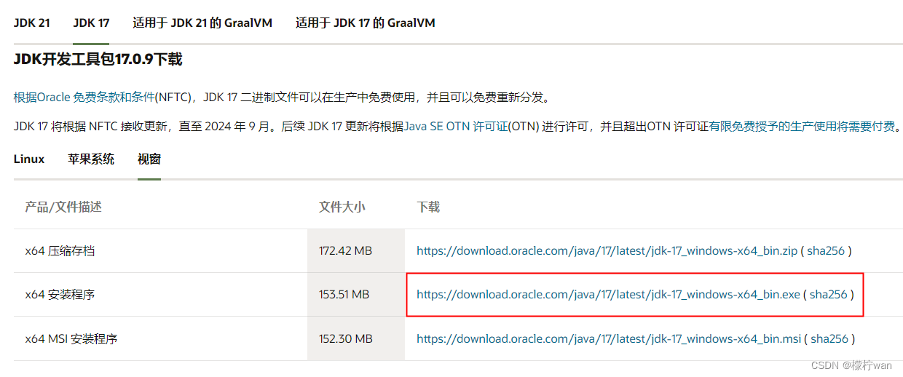
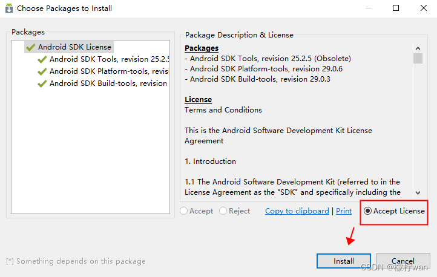
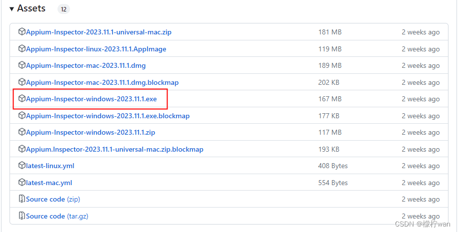
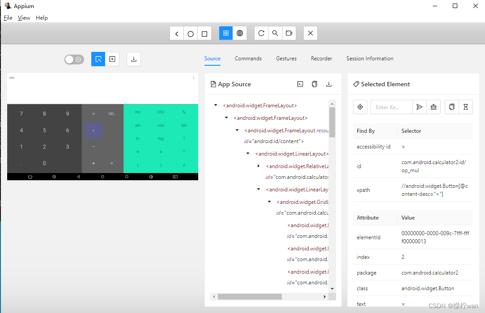

自 2022 年 1 月 1 日起，Appium 核心团队不再维护 Appium 1.x。
官方支持的平台驱动程序的所有最新版本均不兼容 Appium 1.x，需要 Appium 2 才能运行。

Appium 2是一个自动化移动应用程序的开源工具，它带来了以下重要改进：

- 支持最新的移动操作系统版本；
- 进行了性能优化，提高了自动化测试执行的效率和稳定性；
- 引入了新的命令和API，使得测试脚本编写更加灵活和便捷；
- 提供了更新的文档和更加活跃的社区支持。

Appium Inspector是Appium的一个工具，用于分析和检查移动应用程序的UI元素。
它可以帮助用户查看应用程序中的各种元素，并生成相应的定位代码，从而简化自动化测试脚本的编写

### 一、Node.js安装

[Node.js下载](https://nodejs.org/en/download/package-manager)


检测是否安装成功，查看版本命令：node -v


### 二、JDK安装

1、下载并安装 [JDK下载](https://www.oracle.com/cn/java/technologies/downloads/#java17)



2、检测是否安装成功，查看版本命令：java -version （如无法查看，可能是环境变量出现问题，请自行手动配置环境变量）


### 三、Android SDK安装

1、SDK下载链接：[SDK下载](https://www.androiddevtools.cn/)


下载完成后，解压到C盘路径下，路径不要有空格、中文、特殊字符。

2、运行SDK Manager，安装


取消其他勾选框，只保留这三个。




3、配置环境变量

- 新建环境变量ANDROID_HOME，值为SDK路径

```text
变量名：ANDROID_HOME
变量值：C:\android-sdk-windows （SDK目录）
```


```text
变量名：Path
变量值：%ANDROID_HOME%\tools 
变量值：%ANDROID_HOME%\platform-tools
```


### 四、Appium2 安装

1、在命令提示符（cmd）窗口中，输入命令：
```shell
npm i --location=global appium
```

2、查看是否安装成功，版本查看命令：

```shell
appium -v
```

### 五、安装驱动程序

1、安装UIAutomator2，用于安卓设备的驱动程序。cmd窗口输入：

```shell
appium driver install uiautomator2
```

2、安装XCUITest，用于iOS设备的驱动程序。cmd窗口输入：
```shell
appium driver install xcuitest
```
3、查看是否安装成功，命令：

```shell
appium driver list
```
### 六、安装appium-inspector

1、下载并安装 [appium-inspector下载](https://github.com/appium/appium-inspector/releases)




### 七、Appium Inspector 连接Android手机

1、adb命令，检测是否连接：

```shell
adb devices
```


2、连接adb，输入命令：

```shell
adb connect 127.0.0.1:62025
adb devices  ---查看是否连接 （真机USB连接后会自动连接）
```


3、启动Appium服务，输入命令：

```shell
appium
```
默认启用本地4723端口，可以在appium服务中查看


4、运行 Appium Inspector，按如下添加配置

```text
{
  "automationName": "UiAutomator2",          # 自动化测试的引擎
  "platformName": "Android",                 # 平台类型 （Android、ios）
  "platformVersion": "7.1.2",                # 手机操作系统的版本
  "appPackage": "com.android.calculator2",   # app的包名
  "appActivity": ".Calculator",              # app的activity名称
  "unicodeKeyboard": "true",                 # 使用unicode编码方式键盘发送字符串
  "restKeyboard": "true"                     # 隐藏键盘
}
```

其中 appPackage/appActivity 可以通过adb命令查看：

```shell
adb shell "dumpsys window | grep mCurrentFocus"
```



