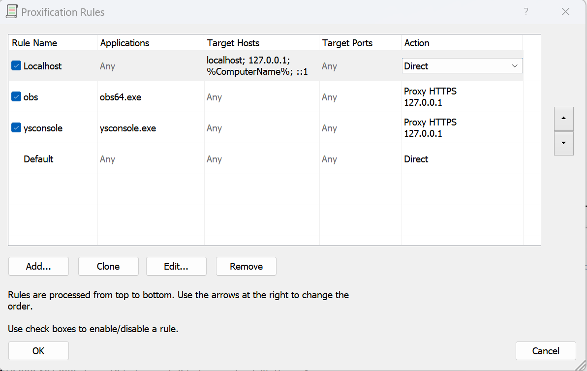

## 常用的网页端抓包工具

### Charles && Fiddler && F12

Charles 和 Fiddler 都是非常有用的工具，适合用于网络请求的捕获、分析和调试。
选择哪一个工具主要取决于个人或项目的需求，例如预算、平台兼容性、用户界面的友好程度以及对特定功能的需求。
如果你需要一个有良好界面和强大的 HTTPS 支持的工具，可以考虑 Charles；如果你需要一个免费且功能强大、可高度自定义的工具， Fiddler 可能是更好的选择。

Charles：

- 流量截取和修改：Charles 能够捕获到本地和远程服务器之间的所有 HTTP 和 HTTPS 请求和响应，并允许用户修改请求或响应数据。
- SSL 代理：Charles 提供 SSL 代理功能，可以解密 HTTPS 流量，方便用户查看加密的内容。
- 带宽限制：Charles 可以模拟慢速网络连接，测试网站在不同带宽下的表现。
- 重放请求：支持捕获的请求的重放功能，方便开发者进行测试。
- 多平台支持：Charles 支持 Windows、Mac OS X 和 Linux。

一般来说，使用 Charles 就够了。

---

## 移动端抓不到包的时候应该怎么办

### ProxyDroid 全局代理机器人

ProxyDroid 是一个在 Android 设备上用于设置代理（Proxy）的应用程序，它可以帮助用户将整个设备的网络流量通过代理服务器进行路由。这对于绕过地理限制、进行网络请求的调试或者增强网络访问的隐私性等场景非常有用。ProxyDroid
支持多种代理类型，如 HTTP、SOCKS4/5 等。

- 支持多种代理类型：ProxyDroid 支持 HTTP、HTTPS、SOCKS4 和 SOCKS5 代理，用户可以根据需要选择合适的代理类型。
- 全局代理设置：与一些仅支持特定应用使用代理的工具不同，ProxyDroid 可以设置全局代理，使得所有的网络请求都通过代理服务器。
- 自动代理（PAC）支持：ProxyDroid 支持自动代理配置（PAC），允许用户通过一个配置文件自动选择是否和如何代理网络请求。
- 多种认证支持：应用支持包括基本认证、摘要认证等多种代理认证方式，适用于各种需要认证的代理服务器。

使用场景：

- 绕过地理限制：通过设置代理服务器，用户可以访问某些仅限特定地区的网络资源。
- 网络请求调试：开发者可以利用 ProxyDroid 来观察和调试应用程序的网络请求，特别是在开发涉及网络通信的应用时。
- 增强隐私和安全：通过代理服务器，用户的网络流量可以被加密，从而提高数据传输过程中的隐私保护和安全性。

> 需要 root 权限：为了设置全局代理，ProxyDroid 需要 Android 设备具有 root 权限。

### PacketCapture

PacketCapture 是一款在 Android 设备上用于捕获和分析网络数据包的应用程序。它不需要设备的 root 权限，这使得它在 Android 用户中非常受欢迎，尤其是对于那些不想或不能对其设备进行 root
操作的用户。PacketCapture 主要用于监控和记录设备上的网络流量，帮助用户或开发者诊断网络问题或分析应用程序的网络使用情况。

- 数据包捕获：PacketCapture 可以捕获设备上的 HTTP、HTTPS、TCP 和 UDP 数据包，帮助用户识别和分析网络流量。
- 解密 HTTPS 流量：该应用能够解密 HTTPS 加密的流量，让用户能够查看 HTTPS 请求和响应的明文内容。这通常通过安装一个本地 SSL 证书来实现，使得 PacketCapture 能够作为中间人拦截和解密流量。
- 实时流量分析：用户可以在应用中实时查看捕获的数据包信息，包括源地址、目标地址、传输协议等。
- 导出功能：捕获的数据可以导出为 PCAP 文件，方便在其他设备或使用其他软件（如 Wireshark）进行更深入的分析。
- 简单的用户界面：PacketCapture 设计有一个简洁的用户界面，使得用户即使不具备深入的网络知识也能容易地使用。

### HttpCanary（小黄鸟）

小黄鸟是一款功能强大的 Android 网络抓包工具，专门用于捕获和分析移动应用的 HTTP 和 HTTPS 网络请求。
与 PacketCapture 类似， HttpCanary 为开发者和技术爱好者提供了深入分析应用网络活动的能力，但它带来了一些独特的功能和改进。

- 支持多种协议：HttpCanary 支持 HTTP/1.1, HTTP/2 以及 WebSocket 协议，可以捕获和分析几乎所有类型的网络请求。
- 详细的数据包分析：应用提供详尽的请求和响应数据，包括头部信息、传输内容和连接详情等。
- HTTPS 解密：通过安装应用内的 CA 证书，HttpCanary 能够解密 HTTPS 加密的流量，允许用户查看加密的通信内容。
- 实时数据捕获和分析：用户可以在应用中实时查看和分析网络数据包，无需等待整个会话结束。
- 过滤和搜索功能：支持基于请求的 URL、IP 地址、应用包名等多种条件进行过滤，方便用户快速找到感兴趣的数据。
- 导出功能：支持将捕获的数据导出为文本、pcap 等格式，便于在其他设备或工具中进一步分析。

> 小黄鸟只要是用来解决抓包证书的问题，可以直接在手机上安装证书，不需要再去电脑上安装证书，非常方便。

### Drony

Drony 是一款在 Android 设备上用于网络代理和流量分析的应用程序。
它可以帮助用户管理和重定向设备上的网络流量，通过指定的代理服务器来进行互联网访问。
Drony 不仅支持普通的 HTTP 和 HTTPS 代理，还支持 SOCKS 协议。这使得它非常适合需要绕过网络限制或进行网络请求分析的用户。

> [https://www.cnblogs.com/lulianqi/p/11380794.html](https://www.cnblogs.com/lulianqi/p/11380794.html)

### Xposed + JustTrustMe

使用 Xposed 结合 JustTrustMe 插件是一种在 Android 设备上绕过 SSL/TLS 证书验证的方法。
这种方法常用于安全测试和网络分析，特别是当你需要捕捉和分析使用 HTTPS 协议的应用数据时。以下是详细的介绍和一些注意事项。

> 可以有效绕过 ssl pinning，但是需要 root 权限。

---

## 桌面应用抓不到包的时候应该怎么办（exe应用）

### Charles && Proxifier

有一些windows应用程序是无法通过Charles/Fiddler单独抓包的，这时候可以使用Charles和Proxifier来抓包。

- 首先在Charles中开启监听端口，然后在Proxifier中设置代理，将流量转发到Charles的监听端口。

- 这样就可以通过Charles抓取到应用程序的流量了。

可以发现，Charles已经成功抓取到了exe应用的流量。

