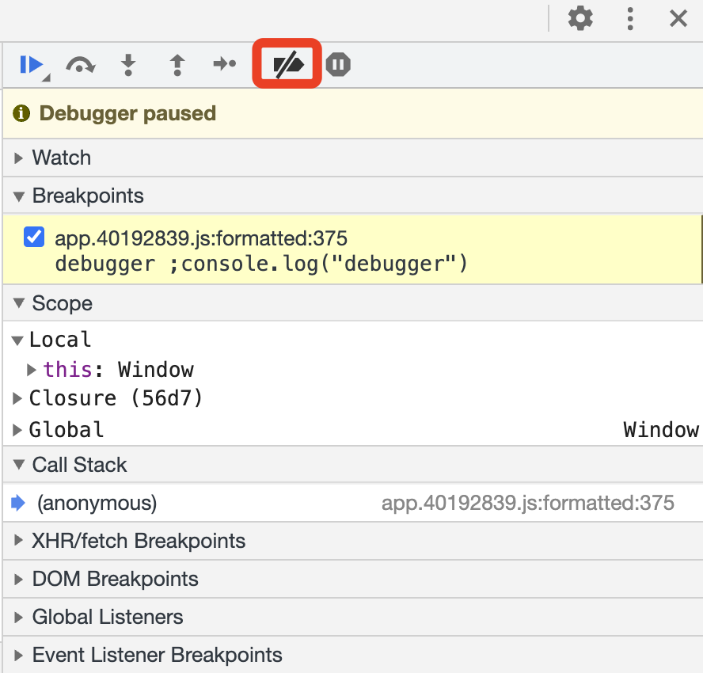

在做爬虫的时候，我们经常会在代码里面遇见 debugger 这么一个关键字。debugger 是 JavaScript 中定义的一个专门用于断点调试的关键字，只要遇到它，JavaScript 的执行便会在此处中断，进入调试模式。

有了 debugger 这个关键字，我们可以非常方便地对 JavaScript 代码进行调试，比如使用 JavaScript Hook 时，我们可以加入 debugger 关键字，使其在关键的位置停下来，以便查找逆向突破口。

但有时候，debugger 会被网站开发者利用，使其成为阻挠我们正常调试的拦路虎。

### 实现原理

我们首先要做的是找到无限 Debugger 的源头。在 Sources 面板中可以看到，debugger 关键字出现在了一个 JavaScript 文件里，这时候点击左下角的格式化按钮，如图所示。

每秒执行 1 次 debugger 语句

当然还有很多类似的实现，比如无限 for 循环、无限 while 循环、无限递归调用等，它们都是可以实现这样的效果的，原理大同小异。

了解了原理，下面我们就对症下药吧！

### 解决方法

因为 debugger 其实就是对应的一个断点，它相当于用代码显式地声明了一个断点，要解除它，我们只需要禁用这个断点就好了。

首先，我们可以禁用所有的断点。全局禁用开关位于 Sources 面板的右上角，叫作 Deactivate breakpoints，如图所示。

全局禁用开关，点击一下它，这时候就会发现所有的断点变成了灰色，如图所示。

然而，取消之后再继续点击 Resume 按钮，它依然不断地停在有 debugger 关键字的地方，并没有什么效果。

其实，Breakpoints 只代表了我们手动添加的断点，对于 debugger 关键字声明的断点，在这里直接取消是没有用的。

那这种情况下还有什么办法吗？

有的。我们可以先将当前 Breakpoints 里面的断点删除，然后在 debugger 语句所在的行的行号上单击鼠标右键，这里会出现一个下拉菜单，如图所示。

点击 Never pause here 选项后的页面，当前断点显示为橙色，这时再次点击 Resume 按钮，就可以发现我们不会再进入无限 Debugger 模式了。